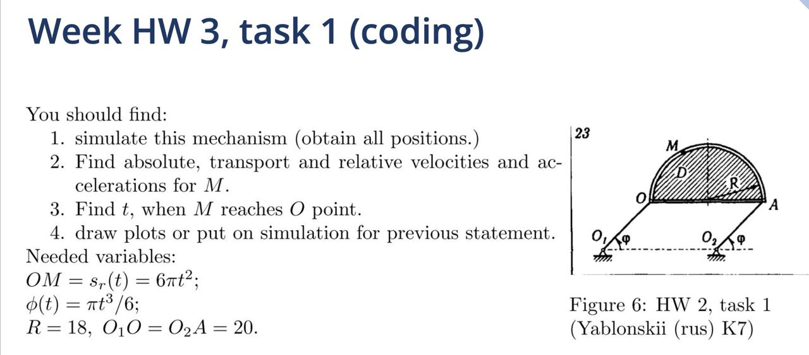
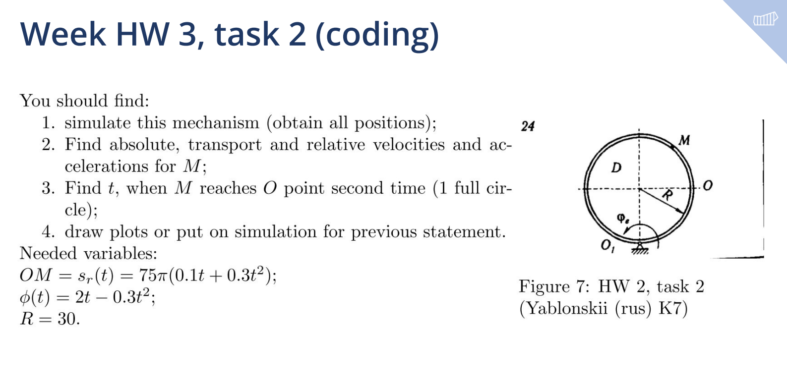

##### Table of Contents  
## [Task 1](#task1)  
### [Poits coordinates](#coord_1)

### [Velocities and accelerations](#vels_1)

### [Finding time](#time_1)

### [Simulation](#sim_1)

## [Task 2](#task2)  
### [Poits coordinates](#coord_2)

### [Velocities and accelerations](#vels_2)

### [Finding time](#time_2)

### [Simulation](#sim_2)

<a name="task1"/>

## Task 1

<a name="coord_1"/>

### 1. Obtain all positions:
Firstly introduce all variables and positions we know from the task already:

$$\theta = \frac{OM}{R}$$

$$\omega_r = \frac{d\theta}{dt}$$

Point $O_1$:

$O_1 = [0,0]$

Point $O_2$:
$O_2 = [2R, 0]$

### Point O

$x = r cos(\phi)$

$y = r sin(\phi)$

### Point A:

$x = r*cos(\phi) + R$

$y = r*sin(\phi)$

### Point M:

$$ x = O_x + R + R*cos(\pi - \theta)$$

$$ y = O_y + R*sin(\theta) \text{, if } \sin(\theta)\leq 0 \text{, then }-R sin(\theta) + O_y$$

$OM = s_r(t) = 6\pi t^2$

<a name="vels_1"/>

### 2. Find absolute, transport and relative velocities and accelerations for M:

Condition for implementing the semicircle movement:

$$i = \begin{cases} 1, &sin(\theta) \geq 0\\  -1, & sin(\theta) < 0 \end{cases}$$

Angular velocities based on the angles:

$$\omega_{\theta} =
\begin{pmatrix}  
0\\
0 \\
\theta' 
\end{pmatrix} = 
\begin{pmatrix}
0\\
0 \\
-\frac{3\pi t}{R}i 
\end{pmatrix}$$

$$\omega_{\phi} = 
\begin{pmatrix}  0\\ 0 \\ \phi' 
\end{pmatrix} = 
\begin{pmatrix}  0\\ 0 \\ \frac{\pi t^2}{2} 
\end{pmatrix}$$

Angular accelerations based for angles $\theta$ and $\phi$:

$$\epsilon_{\theta} =
\begin{pmatrix}  
0\\ 
0 \\
\omega_\theta' 
\end{pmatrix} 
= \begin{pmatrix}
0\\ 
0 \\
-\frac{3\pi}{R}i 
\end{pmatrix}$$

$$\epsilon_{\phi} = \begin{pmatrix} 
0\\
0 \\
\omega_\phi' 
\end{pmatrix} 
= \begin{pmatrix}  
0\\
0 \\
\pi t
\end{pmatrix}$$

$$V^{tr}_M = V_O = \omega_{\phi} \times O_1O \text{, since the body D is moves translational.}$$

$$V^{rel}_M = \omega_{\theta} \times \rho_m \text{ where }\rho_m = \vec{NM}$$

Full $V_M$ :

$$ V_M = V^{tr}_M + V^{rel}_M $$

Relative acceleration:

$$a^{\tau}_M = {\epsilon_{\phi}} \times {\rho_M}$$

$$a^{n}_M = \omega_{\phi} \times (\omega_{\phi} \times \rho_M)$$

Transport acceleration:

$$a^{tr}_M = a_O + \epsilon_{tr} \times \rho_M = a^{\tau}_O + a^{n}_O $$

$\epsilon_{tr} = 0$

$$a^\tau_O = \epsilon_\phi \times O1O$$

$$a^n_O = \omega_\phi \times {(\omega_\phi \times O_1O)}$$

Cor. acceleration:

$$a^{cor}__M = \omega_{tr} \times V^{rel}_M = 0 $$

Full acceleration:
$$a = a^{cor}__M + a^{tr}_M + a^{rel}_M $$

<a name="time_1"/>

## 3. Find t, when M reaches O point:

$\theta = \frac{OM}{R} = 6\pi t^2 = 2\pi R * k$ , where $k \in Z$

$$t^2 = \frac{2 R*k}{6} = \frac{R*k}{3}$$

$t = \sqrt{\frac{Rk}{3}}$

---

<a name="sim_1"/>

## 4. Draw plots or put on simulation for previous statement:

All previous statements are simulated in [geogebra](https://www.geogebra.org/m/vkfjvsvj).

<a name="task2"/>

## Second Task

<a name="coord_2"/>

### 1. Obtain all positions:

Firstly introduce all variables and positions we know from the task already:

$\theta = \frac{OM}{R}$

$\omega_r = \frac{d\theta}{dt}$

Point $O_1$:
$O_1 = [0,0]$

$\rho_m = \vec{O_1M}$

### Point O
$x = O_1O cos(\phi)$

$y = O_1O sin(\phi)$

### Point N:

$x = Rcos(\frac{\pi}{2} + \phi)= -Rsin(\phi)$

$y = Rsin(\frac{\pi}{2} + \phi) = R cos(\phi)$

### Point M:

$x = N_x + R cos(\phi + \theta)$

$y = N_y + R sin(\phi + \theta)$

$OM = s_r(t) = 75 \pi(0.1 t + 0.3 t^2)$
$\phi = 2t - 0.3 t^2$

<a name="vels_2"/>

### 2. Find absolute, transport and relative velocities and accelerations for M:

Angular velocities based on the angles:

$$\omega_{\theta} =
\begin{pmatrix}  
0\\
0 \\
\theta' 
\end{pmatrix} = 
\begin{pmatrix}
0\\
0 \\
\frac{75 \pi(0.1 + 0.6 t)}{R} 
\end{pmatrix}$$

$$\omega_{\phi} = 
\begin{pmatrix}  0\\ 0 \\ \phi' 
\end{pmatrix} = 
\begin{pmatrix}  0\\ 0 \\ 2 - 0.6 t
\end{pmatrix}$$

Angular accelerations based for angles $\theta$ and $\phi$:

$$\epsilon_{\theta} =
\begin{pmatrix}  
0\\ 
0 \\
\omega_\theta' 
\end{pmatrix} 
= \begin{pmatrix}
0\\ 
0 \\
\frac{75 \pi 0.6 t}{R} 
\end{pmatrix}$$

$$\epsilon_{\phi} = \begin{pmatrix} 
0\\
0 \\
\omega_\phi' 
\end{pmatrix} 
= \begin{pmatrix}  
0\\
0 \\
-0.6
\end{pmatrix}$$

$$V^{tr}_M = V_O1 + {\omega_{\phi} \times \rho_M} = \omega_{\phi} \times \rho_M$$

since the body D is moves only rotational.

$V^{rel}_M = \omega_\theta \times \vec{NM}$

Full $ V_M $:

$$ V_M = V^{tr}_M + V^{rel}_M $$

Relative acceleration:

$a^\tau_M = \epsilon_{\phi} \times \vec{NM}$

$$a^n_M = \omega_{\phi} \times (\omega_{\phi} \times \vec{NM})$$

$$a^{rel}_M = a^\tau_M + a^n_M

Transport acceleration:

$$a^{tr}_M = a_O + \epsilon_{tr} \times \rho_M + \omega_{\phi} \times \rho_M = \epsilon_{tr} \times \rho_M + \omega_{\phi} \times \rho_M $$

Cor. acceleration:

$$a^{cor}__M = \omega_{\phi} \times V^{rel}_M  $$

Full acceleration:
$$a = a^{cor}__M + a^{tr}_M + a^{rel}_M $$

<a name="time_2"/>

### 3. Find t, when M reaches O point:

$\theta = \frac{OM}{R} = 75\pi (0.1t + 0.3t^2) = 2\pi R$

$$ 3t^2 + t - \frac{2R}{7.5} = 0 $$

$t_{1,2} = \frac{-1 \pm \sqrt{1+\frac{4* 6R}{7.5}}}{6}$

$t \geq 0$

Answer:

$$t = \frac{-1 + \sqrt{1+\frac{4* 6R}{7.5}}}{6}$$

---

<a name="sim_2"/>

### 4. Draw plots or put on simulation for previous statement:

All previous statements are simulated in [geogebra](https://www.geogebra.org/calculator/m32pdh67).
